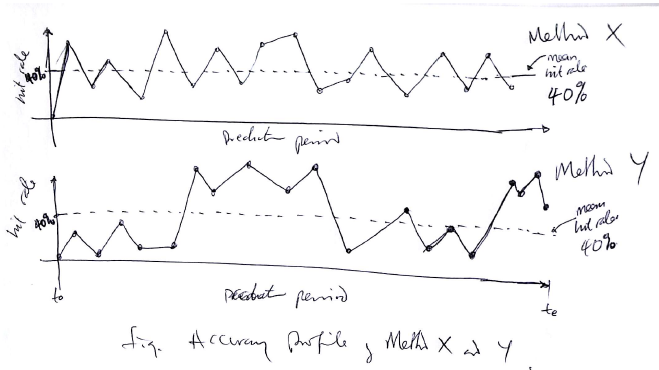

# Markdown quick start

On GitHub you can, using a browser, immediately start editing text files, and so write markdown.

You can embed images into markdown:

Markdown is a simple way to turn plain text into formatted text, much like HTML, but with a much more lightweight syntax.

## Guides

- [Wikipedia page with a quick guide](https://en.wikipedia.org/wiki/Markdown)
- [GitHub guide pages](https://guides.github.com/features/mastering-markdown/)
- [Markdown cheat-sheet](https://github.com/adam-p/markdown-here/wiki/Markdown-Cheatsheet)
- [Original guide](https://daringfireball.net/projects/markdown/syntax)

## Editors

- I tend to use [Visual Studio Code](https://code.visualstudio.com/) for editing, as it support markdown out of the box.  Pressing Ctrl-K and the V opens a live preview.
- A nice on-line editor is [JBT markdown-editor](https://jbt.github.io/markdown-editor) which works in any web-browser.  You can't preview images, of course.
